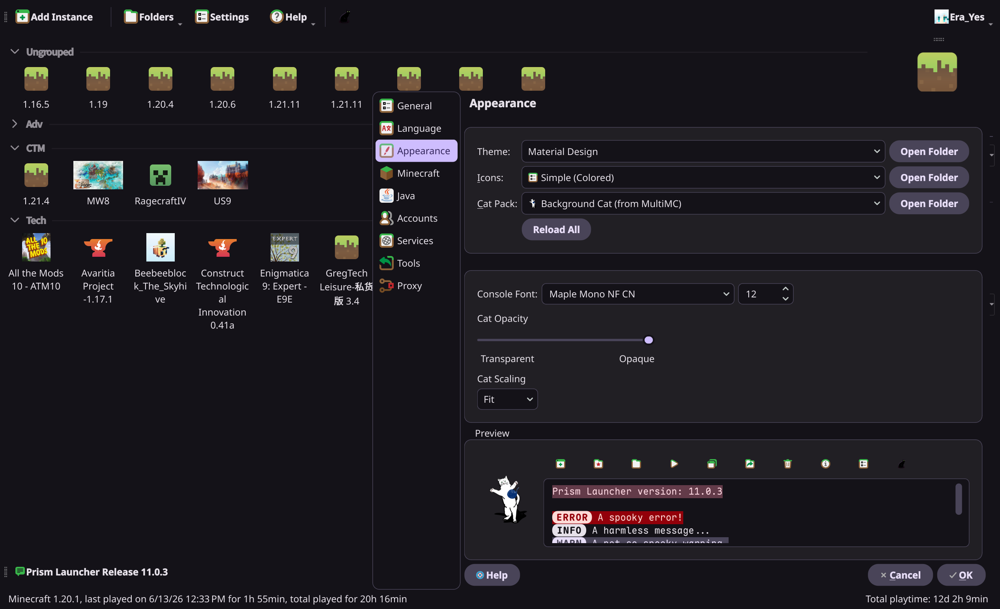

<!--
SPDX-FileCopyrightText: 2026 ErinaYip

SPDX-License-Identifier: MIT
-->

# PrismLauncher Material Design Theme

A dark Material Design 3 inspired widget theme for Prism Launcher.

The installable theme lives in
[`themes/Material-Design`](themes/Material-Design). Copy the whole folder into
your Prism Launcher themes directory so the final structure is:

```text
PrismLauncher/themes/Material-Design/theme.json
PrismLauncher/themes/Material-Design/themeStyle.css
PrismLauncher/themes/Material-Design/resources/*.svg
```

Then restart Prism Launcher and select `Material Design` under Settings >
Launcher > User Interface > Widgets.

## Preview



## Dynamic Colors With Matugen

Color configuration lives in `theme.json`. The stylesheet uses Qt `palette(...)`
roles, so matugen only needs to regenerate that one file.

Generate colors from an image into this repository:

```sh
matugen -c matugen/config.example.toml image /path/to/wallpaper.jpg
```

Generate colors from a single hex color:

```sh
matugen -c matugen/config.example.toml color hex "#6750A4"
```

For an installed PrismLauncher theme, copy
`themes/Material-Design/themeStyle.css` once, then change `output_path` in
[matugen/config.example.toml](matugen/config.example.toml) to your PrismLauncher
themes directory so matugen updates only `theme.json`.

## References

- [PrismLauncher/Themes](https://github.com/PrismLauncher/Themes)
- [Prism Launcher theme docs](https://prismlauncher.org/wiki/getting-started/change-themes/)
- [Material Design 3](https://m3.material.io/)
- [Material Web](https://github.com/material-components/material-web)

## License

```text
SPDX-FileCopyrightText: 2026 ErinaYip
SPDX-License-Identifier: MIT
```
